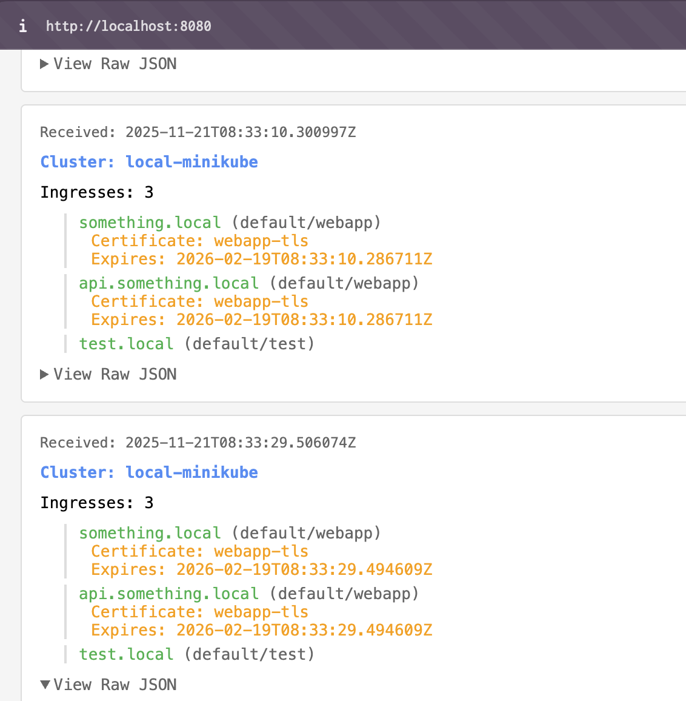

# Kubernetes Ingress & Certificate Observer Operator

A Kubernetes operator built with Python and [kopf](https://kopf.readthedocs.io/) that watches Ingress resources in a cluster and periodically reports summarized data about them to a report receiver service with a web UI.

## Overview

This operator:
- Watches all Ingress resources in the cluster
- Collects namespace, name, and hostname(s) from each Ingress
- Extracts TLS certificate information from referenced Secrets
- Periodically sends JSON reports to a report receiver service (configurable)
- Maintains an in-memory cache of Ingress resources

The report receiver service:
- Receives reports from the operator via HTTP POST
- Stores reports in memory (configurable limit)
- Displays reports in a simple web UI accessible via HTTP GET

## Prerequisites

- [Minikube](https://minikube.sigs.k8s.io/docs/start/) installed and running
- [kubectl](https://kubernetes.io/docs/tasks/tools/) configured to connect to your Minikube cluster
- [Docker](https://www.docker.com/) installed (for building the container image)
- Python 3.11+ (for local development/testing, optional)

## Project Structure

```
k8s-operator-test-task/
├── operator/
│   └── ingress_observer.py      # Main operator code
├── receiver/
│   ├── app.py                   # Report receiver service (Flask)
│   ├── requirements.txt         # Receiver dependencies
│   └── Dockerfile               # Receiver container image
├── manifests/
│   ├── deployment.yaml          # Operator deployment
│   ├── rbac.yaml                # ServiceAccount, ClusterRole, ClusterRoleBinding
│   ├── report-receiver-deployment.yaml  # Receiver deployment
│   ├── report-receiver-service.yaml     # Receiver service
│   └── test-ingress.yaml        # Sample Ingress for testing
├── Dockerfile                    # Operator container image definition
├── requirements.txt              # Operator Python dependencies
└── README.md                     # This file
```

## Setup Instructions

### 1. Start Minikube

```bash
minikube start
```

Verify your cluster is running:
```bash
kubectl cluster-info
```

### 2. Build the Docker Images

Both the operator and report receiver need to be built as Docker images and loaded into Minikube's Docker daemon.

```bash
# Build the operator image
docker build -t ingress-observer:latest .

# Build the report receiver image
docker build -t report-receiver:latest ./receiver

# Load both images into Minikube
minikube image load ingress-observer:latest
minikube image load report-receiver:latest
```

### 3. Deploy the Report Receiver Service

Deploy the report receiver service first (the operator depends on it):

```bash
# Apply the receiver deployment and service
kubectl apply -f manifests/report-receiver-deployment.yaml -f manifests/report-receiver-service.yaml
```

Verify the receiver is running:
```bash
kubectl get pods -l app=report-receiver
kubectl logs -l app=report-receiver --tail=20
```

### 4. Deploy the Operator

Apply the RBAC and Deployment manifests:

```bash
# Apply RBAC configuration
kubectl apply -f manifests/rbac.yaml

# Apply the Deployment
kubectl apply -f manifests/deployment.yaml
```

Verify the operator is running:
```bash
kubectl get pods -l app=ingress-observer
kubectl logs -l app=ingress-observer --tail=50
```

You should see logs indicating the operator has started:
```
Ingress Observer Operator starting
Cluster: local-minikube
Report endpoint: http://report-receiver.default.svc.cluster.local:8080/report
Report interval: 45 seconds
```

### 5. Access the Report Receiver Web UI

To view the reports in the web UI, set up port forwarding:

```bash
kubectl port-forward service/report-receiver 8080:8080
```

Then open your browser and navigate to:
```
http://localhost:8080
```

You should see a web page displaying all received reports, including:
- Timestamp of each report
- Cluster name
- List of ingresses with their hosts, namespaces, and certificate information
- Raw JSON view for each report

### 6. Create Test Ingress Resources

Deploy the sample Ingress resources:

```bash
kubectl apply -f manifests/test-ingress.yaml
```

This creates:
- A TLS Secret (`webapp-tls`)
- An Ingress with TLS configuration (`webapp`)
- An Ingress without TLS (`example-ingress`)

Verify the Ingresses are created:
```bash
kubectl get ingresses
```

## Testing

### Check Operator Logs

Watch the operator logs to see it processing Ingress resources:

```bash
kubectl logs -f deployment/ingress-observer
```

You should see:
- Startup messages
- Ingress create/update/delete events
- Periodic report generation messages
- Report sending status

### Verify Reports

With the report receiver service running and port forwarding active (from step 5), you should see reports arriving every 45 seconds (configurable via `REPORT_INTERVAL` environment variable) in the web UI.

```

### Test Ingress Changes

Create, update, or delete Ingress resources and observe:
1. The operator logs the changes
2. The next periodic report reflects the changes

```bash
# Create a new Ingress
kubectl create ingress test --rule="test.local/*=test-service:80"

# Delete an Ingress
kubectl delete ingress example-ingress
```

## Configuration

The operator can be configured via environment variables in the Deployment:

- `CLUSTER_NAME`: Name of the cluster (default: `local-minikube`)
- `REPORT_ENDPOINT`: HTTP endpoint to send reports to (default: `http://report-receiver.default.svc.cluster.local:8080/report`)
- `REPORT_INTERVAL`: Interval in seconds between reports (default: `45`)

The report receiver can be configured via environment variables:

- `PORT`: Port to listen on (default: `8080`)
- `MAX_REPORTS`: Maximum number of reports to store in memory (default: `100`)

## Cleanup

To remove all resources:

```bash
# Delete test Ingresses
kubectl delete -f manifests/test-ingress.yaml

# Delete the operator
kubectl delete -f manifests/deployment.yaml
kubectl delete -f manifests/rbac.yaml

# Delete the report receiver
kubectl delete -f manifests/report-receiver-service.yaml
kubectl delete -f manifests/report-receiver-deployment.yaml
```

## Architecture

**Operator:**
- **Indexing**: Uses kopf's `@kopf.index` decorator to maintain an in-memory cache of all Ingress resources
- **Event Handling**: Watches for create, update, and delete events on Ingress resources
- **Periodic Reporting**: Uses an asyncio background task to send reports at configured intervals
- **Certificate Detection**: Reads TLS Secrets referenced by Ingress resources to extract certificate information

**Report Receiver:**
- **HTTP Service**: Flask-based web service listening on port 8080
- **Report Storage**: In-memory storage using a deque with configurable maximum size
- **Web UI**: Simple HTML interface displaying reports with timestamps, cluster info, and ingress details
- **Health Endpoint**: `/health` endpoint for Kubernetes liveness/readiness probes

## Limitations

- Certificate expiry dates are currently dummy values (90 days from current time). Real x509 parsing is not implemented (as per requirements).
- The operator sends reports to a single endpoint. For production use, consider implementing retry logic and multiple endpoints.
- Reports are sent even if there are no Ingress resources (empty list).
